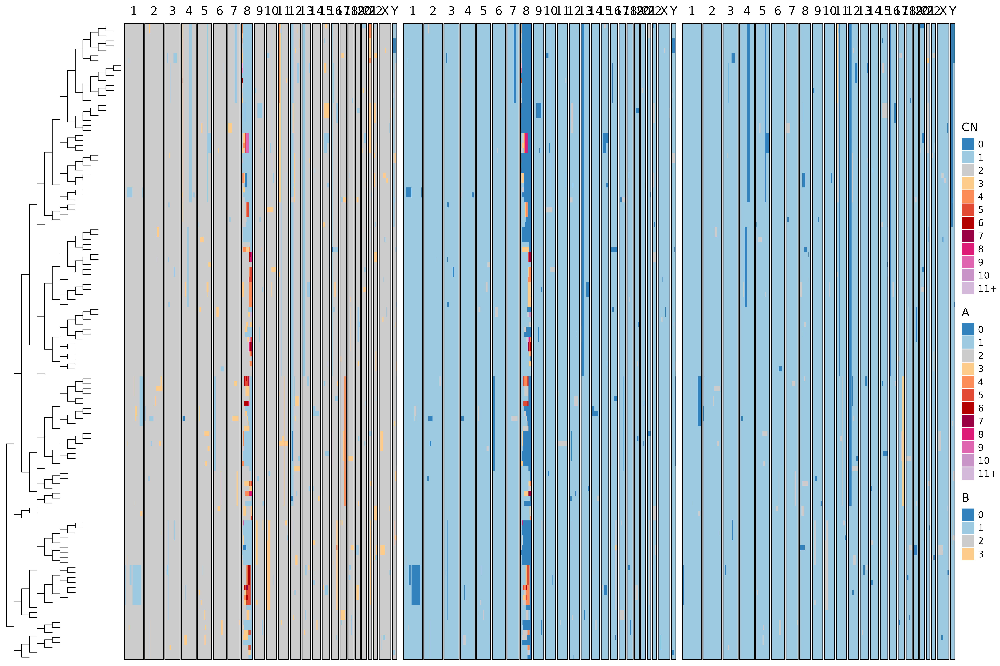
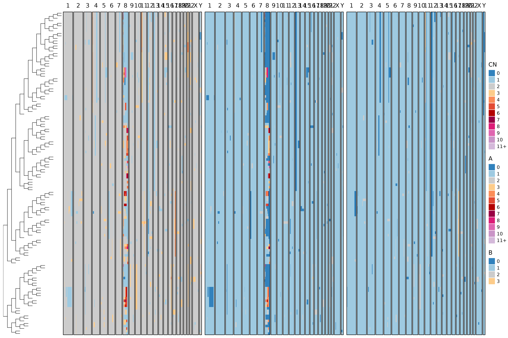
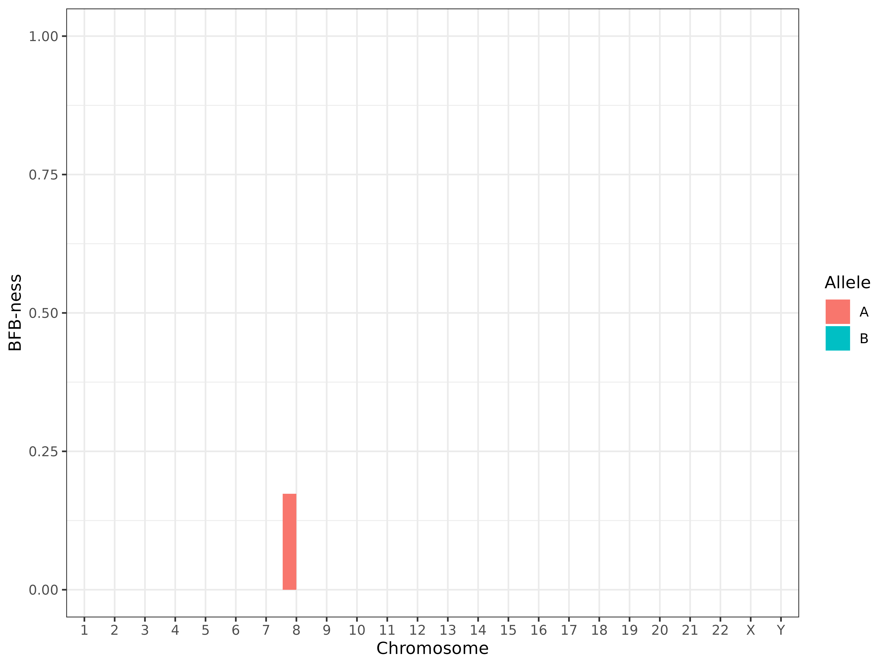

# Using bridges

This tutorial demonstrates how to simulate copy number evolution with
BFB (Breakage-Fusion-Bridge) events, infer phylogenies from
allele-specific CNAs, and visualize the output using the `bridges` R
package.

## Load Required Libraries

``` r
library(bridges)
library(ggplot2)
library(dplyr)
library(phangorn)
```

## Step 1: Simulate Copy Number Evolution

We simulate a single BFB event on chromosome 8, allele A, across 128
cells.

``` r
alleles_to_use <- c("A", "B")

sim <- bridges::bridge_sim(
  max_cells = 128,
  bfb_allele = c("8:A"),
  normal_dup_rate = 0,
  lambda = 2
)

head(sim$cna_data)
#> # A tibble: 6 × 8
#>   cell_id chr   bin_idx     A     B    CN   start     end
#>   <chr>   <chr>   <int> <int> <int> <int>   <dbl>   <dbl>
#> 1 cell_10 1           1     1     1     2       1 1000000
#> 2 cell_10 1           2     1     1     2 1000001 2000000
#> 3 cell_10 1           3     1     1     2 2000001 3000000
#> 4 cell_10 1           4     1     1     2 3000001 4000000
#> 5 cell_10 1           5     1     1     2 4000001 5000000
#> 6 cell_10 1           6     1     1     2 5000001 6000000
```

## Step 2: Fit the Phylogeny to the CNA Data

We run inference on the simulated data, disabling jitter smoothing.

``` r
k_jitter_fix <- 0

res <- bridges::fit(
  data = sim$cna_data,
  alleles = alleles_to_use,
  k_jitter_fix = k_jitter_fix
)
```

## Step 3: Compare Inferred and True Trees

We compare the inferred tree to the true simulated one using
Robinson-Foulds distance.

``` r
true_tree <- sim$tree
inferred_tree <- res$tree

phangorn::RF.dist(true_tree, inferred_tree, normalize = TRUE)
#> [1] 0.152
```

## Step 4: Visualize CN Profiles with Trees

We can visualize both the true and inferred trees alongside
allele-specific CN profiles.

``` r
bridges::plot_heatmap(
  sim$cna_data,
  tree = sim$tree,
  use_raster = FALSE,
  ladderize = TRUE,
  to_plot = c("CN", "A", "B"),
  branch_length = 1
)
```



``` r
bridges::plot_heatmap(
  sim$cna_data,
  tree = res$tree,
  use_raster = FALSE,
  ladderize = TRUE,
  to_plot = c("CN", "A", "B"),
  branch_length = 1
)
```



## Step 5: Detect BFB Signatures

We use the built-in BFB detection function to quantify “BFB-ness” per
chromosome and allele.

``` r
bfb_detection_df <- bridges::detect_bfb(res)
head(bfb_detection_df)
#> # A tibble: 6 × 8
#>    mean N_trials N_successes chr   allele p.value threshold adj.pval
#>   <dbl>    <int>       <int> <chr> <chr>    <dbl>     <dbl>    <dbl>
#> 1     0      127           0 1     A            1     0.005        1
#> 2     0      127           0 2     A            1     0.005        1
#> 3     0      127           0 3     A            1     0.005        1
#> 4     0      127           0 4     A            1     0.005        1
#> 5     0      127           0 5     A            1     0.005        1
#> 6     0      127           0 6     A            1     0.005        1

bfb_detection_df %>%
  dplyr::mutate(chr = factor(chr, levels = c(1:22, "X", "Y"))) %>%
  ggplot(aes(x = chr, y = mean, fill = allele)) +
  geom_col(position = "dodge") +
  theme_bw() +
  lims(y = c(0, 1)) +
  labs(x = "Chromosome", y = "BFB-ness", fill = "Allele")
```


